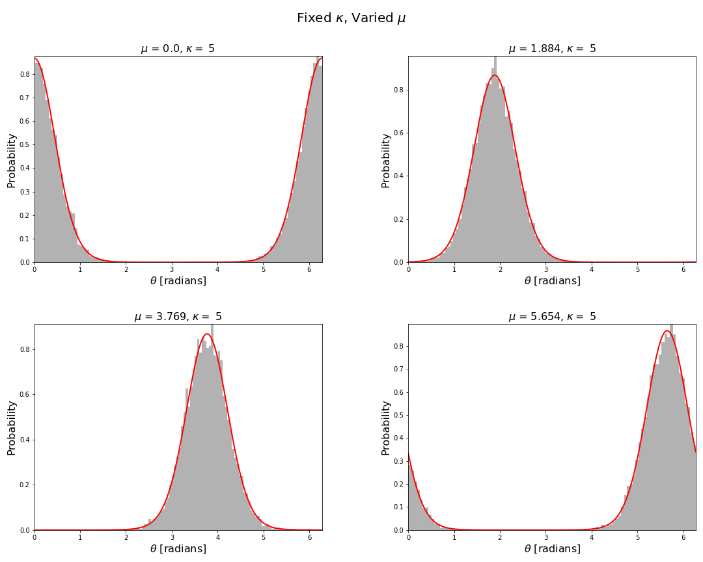
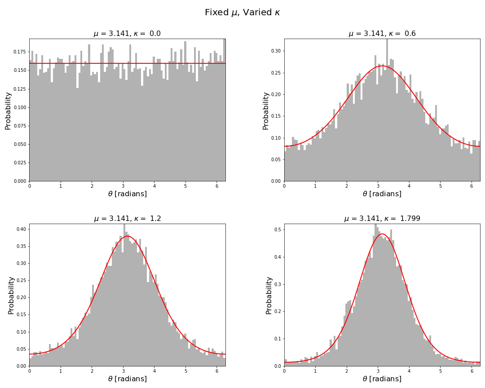
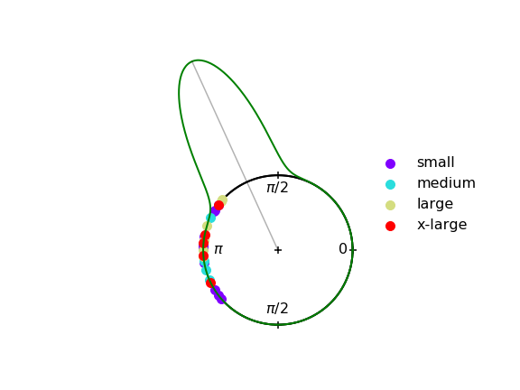
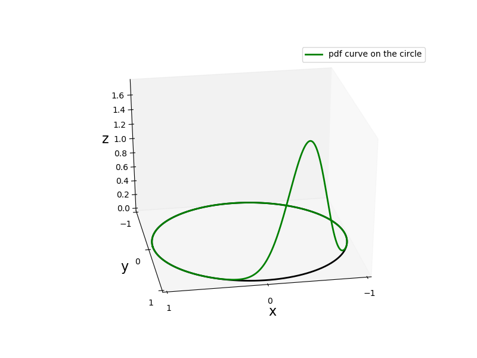
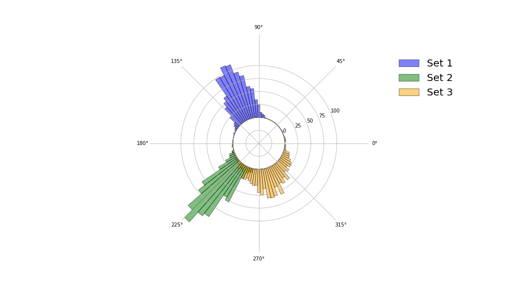

# Sampling and Visualising the von Mises Distribution  

In this repository we implement functions to calculate and sample from the von Mises distribution [1]. Moreover, we also implement a few simple functions to visualise circular distributions. Strictly speaking one does not need to write their own implementation for calculating the von-Mises probability density function or sampling from it, as it is available in the [scipy statistics package](https://docs.scipy.org/doc/scipy/reference/generated/scipy.stats.vonmises.html).  Numpy also has an implementation as well, which can be found [here](https://numpy.org/doc/1.16/reference/generated/numpy.random.vonmises.html). However, it is quite easy to write your own implementation (see Refs. [2,3]).

In this notebook we will be making use of the algorithm by Best and Fisher to sample the von-Mises distribution. This algorithm only requires sampling of a uniform distribution on $[0,1]$ and using some trignometric and logarithmic  functions [2]. We will also visualise the data.

## Why consider the von Mises distribution

The von Mises distribution was introduced by Richard von Mises in 1918 [1]. Angular random variables are more naturally modelled using circular distributions, like the von Mises distribution, rather than the almost ubiquitous use of normal distributions. They are more natural  for a number of reasons, a few of which we will now briefly mention:

- The von Mises distribution is defined on the correct sample space whereas the normal distribution is not bounded to the interval of length $2\pi$, e.g., $[-\pi,\pi)$ or $[0,2\pi)$. The normal distribution can be a good approximation away from the boundaries. However, its use can lead to issues near the boundaries.

- The von Mises distribution has the correct limiting behaviour as $\kappa\to 0$ whereas the normal distribution does not. The von Mises distribution approaches the uniform distribution on the unit circle in this limit, so that all directions are equally likely.

- Naive use of normal distributions for circular problems can lead to the incorrect fusion of the prior with the measurement likelihood. Therefore, for example, if you were performing angle of arrival measurements in a tracking application you may be incorrectly fusing measurements when performing a Bayesian update.

## A few plots

## References

   1. Von Mises, R., Uber die 'Ganzzahligkeit' der Atomgewichte und verwandte Fragen, Physikalische Zeitschrift, 19, 490--500, (1918).

   2. Best, D. J.  and Fisher, N. I. , Efficient Simulation of the von-Mises Distribution, J. Appl. Stat.,28, 152--157, (1979).

   3. Fisher, N. I., Statistical Analysis of Circular Data, , Cambridge University Press, (1993)
